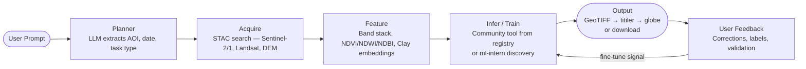
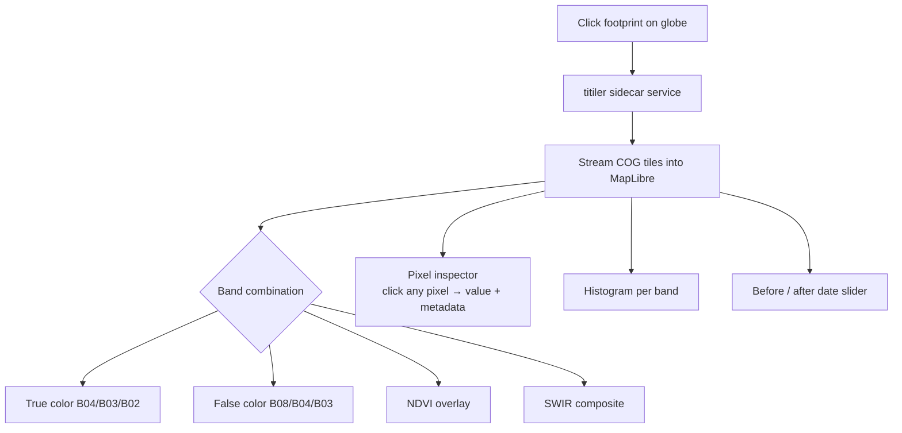
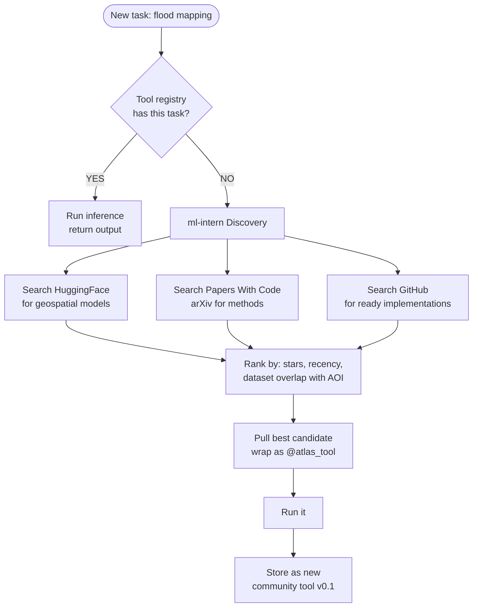
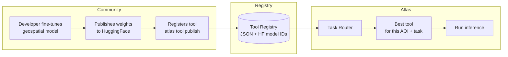
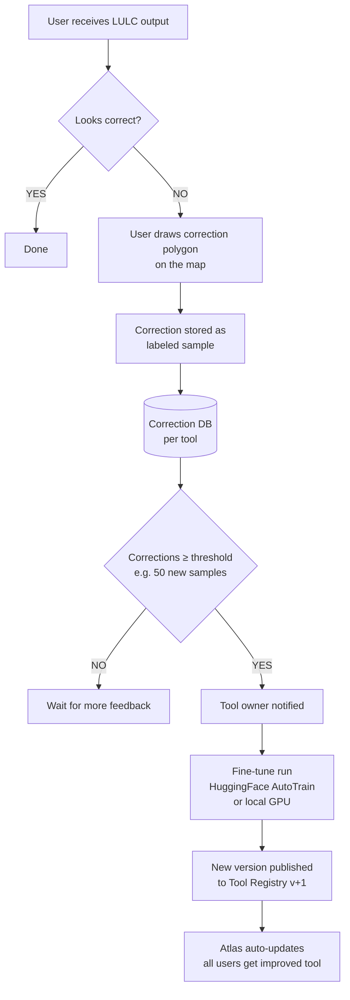
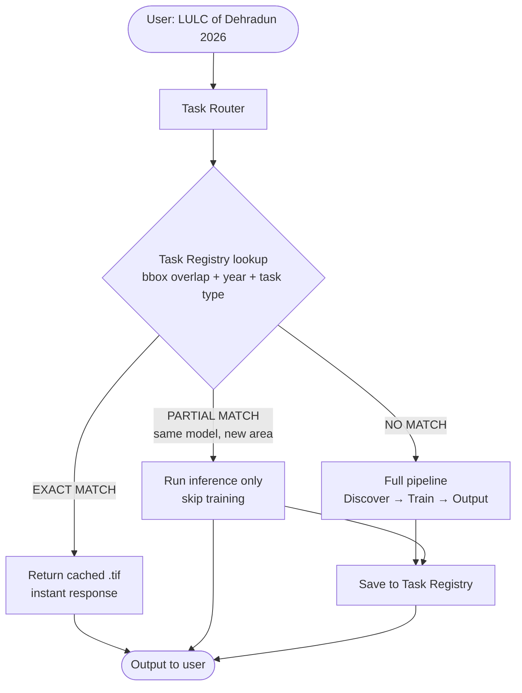
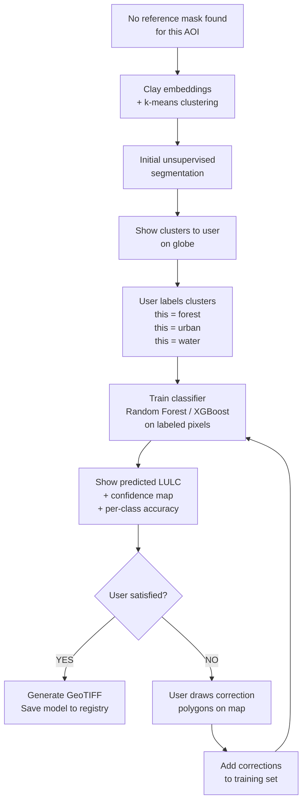
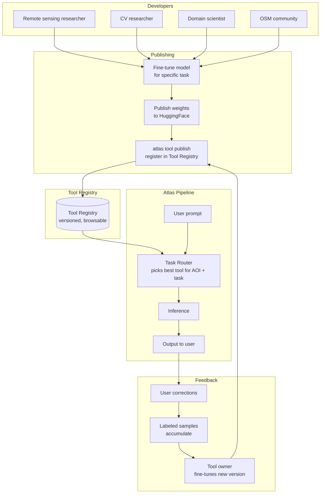

# Atlas GeoAI — Roadmap

> **Vision: Natural language interface to every geospatial AI task ever built, with a community layer that makes it smarter over time.**
>
> ArcGIS Pro costs $800/year, requires expertise, and has no AI. Atlas is free, conversational, and learns.

---

## Current State

```
✅ L1 COMPLETE
   Natural language → STAC search → globe footprints + download links
   Planner (LLM) → STAC Scout (Element84) → Response → WebSocket stream → MapLibre globe
```

---

## The Unified Pipeline

Every GeoAI task — LULC, flood mapping, object detection, OSINT, network extraction — runs through the same four nodes. Only the model inside changes.



---

## Build Phases

### Phase 1 — See Actual Pixels
*titiler + COG streaming*



---

### Phase 2 — ml-intern Integration
*Auto-discover models for new task types*

When Atlas encounters a task it has never seen, it should not fail — it should search.



---

### Phase 3 — Tool Registry
*Community publishes tools. Atlas discovers them.*



**Tool entry structure:**
```
tool: "lulc-sentinel2-india"
  author:        @developer
  model:         HuggingFace model ID or local weights
  input:         bbox, date_range, cloud_max, satellite
  output:        GeoTIFF + accuracy report
  validated_on:  ["Dehradun", "Mumbai", "Delhi"]
  version:       1.3
  feedback_count: 47
  avg_accuracy:  0.89
```

---

### Phase 4 — Feedback Loop + Self-Improvement
*Users correct outputs → corrections accumulate → tool owners fine-tune → new version*



**This is not RLHF.** The model weights do not update automatically. The community is the training data pipeline — users label corrections, tool owners trigger fine-tuning, Tool Registry versions the releases.

---

### Phase 5 — Task Memory
*Check if this job was done before. If yes, skip training entirely.*



**Task Registry entry:**
```
task_type:    LULC
area:         Dehradun
bbox:         [77.8, 30.2, 78.2, 30.5]
year:         2026
satellite:    sentinel-2-l2a
scheme:       Anderson Level 1
model_path:   models/lulc_dehradun_2026.pkl
output_path:  outputs/lulc_dehradun_2026.tif
accuracy:     0.87
trained_at:   2026-04-24
```

---

### Phase 6 — Interactive Training Loop
*User can stop and correct the training process at any point*



---

## All Task Categories

### Land & Environment

| Task | Satellite Input | Output |
|---|---|---|
| LULC / Land cover | Sentinel-2, Landsat | Class GeoTIFF |
| Deforestation detection | Multi-date Sentinel-1/2 | Change polygons |
| Flood mapping | Sentinel-1 SAR | Flood extent GeoTIFF |
| Wildfire burn scar | Sentinel-2 post-fire | Burn area polygons |
| Crop type mapping | Sentinel-2 time series | Crop class map |
| Soil moisture | Sentinel-1 SAR | Moisture raster |
| Urban heat island | Landsat thermal | Temperature raster |
| Glacier retreat | Multi-date Sentinel-2 | Change polygons |

### Urban & Infrastructure

| Task | Input | Output |
|---|---|---|
| Building footprint extraction | VHR imagery, SAR | GeoJSON polygons |
| Road network extraction | VHR imagery | GeoJSON linestrings |
| Construction detection | Multi-date imagery | Change polygons |
| Solar panel mapping | VHR imagery | GeoJSON polygons |
| Informal settlement mapping | Sentinel-2, VHR | Class polygons |
| Green space mapping | Multispectral + NDVI | Class GeoTIFF |
| Parking lot occupancy | VHR time series | Occupancy % over time |

### OSINT & Intelligence

| Task | Input | Output |
|---|---|---|
| Military asset detection | VHR optical / SAR | Bounding boxes + labels |
| Port activity monitoring | Sentinel-1 SAR, VHR | Ship counts, movement tracks |
| Airfield activity | VHR time series | Aircraft count, change detection |
| Shadow-based height estimation | VHR optical | Structure heights |
| Supply chain monitoring | Multi-date VHR | Inventory change at facilities |
| Border crossing activity | SAR + optical fusion | Activity heatmap |
| Night light change | VIIRS / DMSP | Economic activity proxy |

### Object Detection

| Task | Input | Output |
|---|---|---|
| Ship detection | Sentinel-1 SAR, VHR | Bounding boxes, AIS fusion |
| Aircraft detection | VHR optical | Bounding boxes + type |
| Vehicle counting | VHR optical | Count + density map |
| Wind turbine mapping | Sentinel-1/2 + VHR | Point locations |
| Mining activity | Sentinel-2 + SAR | Extent polygons |
| Oil tank detection | VHR optical | Point locations + volume |
| Aquaculture ponds | Sentinel-2 | Polygon boundaries |
| Plastic waste in water | Sentinel-2 | Density raster |

### Network Generation

| Task | Input | Output |
|---|---|---|
| Road network extraction | VHR optical | Routable GeoJSON graph |
| River network delineation | Copernicus DEM | Drainage network GeoJSON |
| Power line mapping | VHR optical / LiDAR | Line GeoJSON |
| Pipeline routing | DEM + land cover | Optimal path GeoJSON |
| Hydrological connectivity | DEM + satellite | Watershed + flow network |

### Change Detection

| Task | Input | Output |
|---|---|---|
| Generic bi-temporal change | Any two-date imagery | Change mask GeoTIFF |
| Coastline erosion | Multi-year Sentinel-2 | Shoreline shift polygons |
| Post-disaster damage | Pre/post optical or SAR | Damage class GeoTIFF |
| Archaeological site change | Multi-year VHR | Disturbance polygons |
| Lake / reservoir level change | SAR + optical | Water extent time series |

### 3D & Elevation

| Task | Input | Output |
|---|---|---|
| Building height estimation | SAR coherence / stereo | Height raster |
| Tree canopy height | ICESat-2 + Sentinel | Canopy height model |
| DEM generation | SAR interferometry | DEM GeoTIFF |
| Subsidence monitoring | Sentinel-1 InSAR | Displacement raster |
| Landslide susceptibility | DEM + geology + rainfall | Risk raster |

### Forecasting & Prediction

| Task | Input | Output |
|---|---|---|
| Crop yield prediction | NDVI time series + weather | Yield estimate by polygon |
| Flood risk forecasting | DEM + precipitation forecast | Risk raster |
| Fire spread prediction | NDVI + wind + terrain | Spread probability raster |
| Urban growth modeling | Multi-year LULC | Projected LULC GeoTIFF |
| Drought monitoring | NDVI + SPI anomaly | Drought index raster |

### Specialized Science

| Task | Input | Output |
|---|---|---|
| Coral reef health | Hyperspectral / Sentinel-2 | Health class GeoTIFF |
| Air quality proxy | Sentinel-5P NO2/CO | Pollution raster |
| Mangrove mapping | SAR + optical | Extent + density GeoTIFF |
| Wetland delineation | SAR + DEM + optical | Class GeoTIFF |
| Permafrost monitoring | Sentinel-1 InSAR + thermal | Thaw indicator raster |
| Kelp forest mapping | Sentinel-2 | Biomass GeoTIFF |

---

## Ready-to-Use Models (Implement Now)

### Clay Foundation Model

Clay embeddings are chip-based — 256×256 patch → 768-dim embedding. Every downstream task is a different head on the same embeddings. Once the Clay inference pipeline works for one task, **every other Clay task is 80% the same code**.

| Task | Notes |
|---|---|
| LULC | Reference implementation exists |
| Flood mapping | Sen1Floods11 dataset |
| Crop type mapping | EuroCrops compatible |
| Cloud segmentation | CloudSen12 dataset |

### Prithvi — IBM + NASA (Most Production-Ready)

All hosted on HuggingFace. All Sentinel-2/HLS compatible. Inference API available — **no GPU required to test**.

| Task | HuggingFace ID |
|---|---|
| Flood mapping | `ibm-nasa-geospatial/Prithvi-100M-sen1floods11` |
| Burn scar mapping | `ibm-nasa-geospatial/Prithvi-100M-burn-scar` |
| Crop classification | `ibm-nasa-geospatial/Prithvi-100M-multi-temporal-crop-classification` |
| Cloud segmentation | `ibm-nasa-geospatial/Prithvi-100M-cloudSEN12` |

### SAM-based (Segment Anything for Geospatial)

`samgeo` — pip installable, works with any tile server, no training required.

| Task | Notes |
|---|---|
| Building footprints | Prompt with point → building polygon |
| Field boundary delineation | Click a field → get boundary |
| Any object segmentation | Works with any VHR imagery |

### Other Ready Models

| Model | Task | Key Property |
|---|---|---|
| RemoteCLIP | Zero-shot object detection | No training needed — any class |
| ChangeFormer (LEVIR-CD) | Generic change detection | Any bi-temporal Sentinel-2 pair |
| Meta HighResMaps | Tree canopy height | Global model, inference only, 1m resolution |
| Microsoft GlobalMLBuildingFootprints | Building extraction | Global coverage |

---

## Implementation Effort

```
Easiest — days
├── Prithvi flood mapping        HF inference API, no GPU
├── Prithvi burn scar            same pipeline as flood
├── samgeo building footprint    pip install, works immediately
├── Meta canopy height           inference only, global model
└── RemoteCLIP zero-shot         no training, any class

Medium — weeks
├── Clay LULC                    needs band stacking pipeline
├── Clay crop mapping            needs time-series stacking
├── ChangeFormer change detect   needs bi-temporal STAC fetch
└── Prithvi crop classification  needs HLS preprocessing

Harder — months
├── Clay + user corrections      needs interactive labeling UI
├── InSAR subsidence             needs SAR preprocessing (SNAP)
└── Custom fine-tune loop        needs GPU + training infra
```

---

## Community Architecture



Different communities own different categories:

| Category | Who builds tools |
|---|---|
| Land & Environment | Remote sensing researchers, NGOs |
| Urban & Infrastructure | Urban planners, OSM community |
| OSINT | Defense researchers, journalists |
| Object Detection | CV researchers — DOTA, xView datasets |
| Network Generation | Routing and mapping engineers |
| Specialized Science | Domain scientists per field |

---

## Summary

```
Phase 1   titiler + pixel viewing          make outputs visible
Phase 2   ml-intern integration            auto-discover HF models for new task types
Phase 3   Tool Registry v1                 community submits tools via PR
Phase 4   Feedback collection API          store user corrections per tool
Phase 5   Task memory                      skip training when job was done before
Phase 6   Interactive correction loop      human-in-the-loop LangGraph node
Phase 7   Fine-tune trigger                tool owners notified, AutoTrain integration
Phase 8   Tool Registry hosted             public, versioned, browsable in Atlas UI
```
